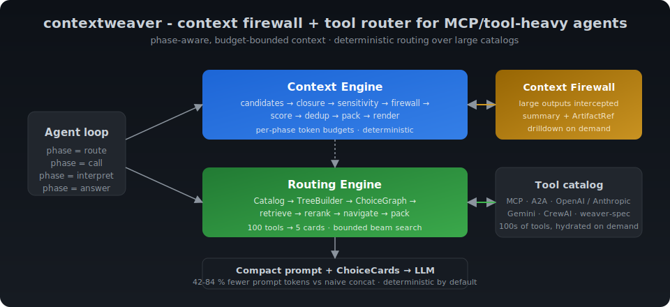
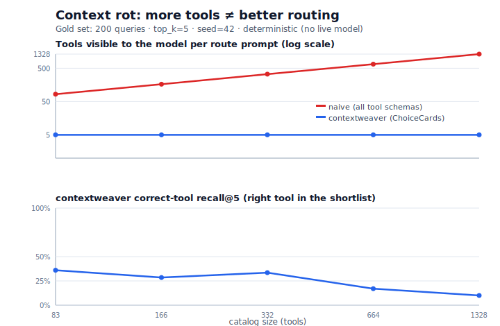
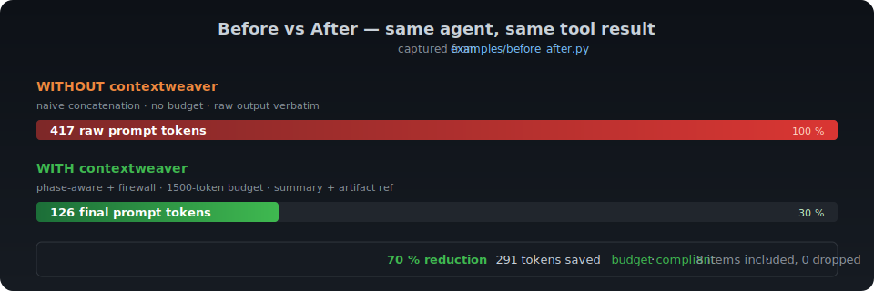

# contextweaver

<!-- mcp-name: io.github.dgenio/contextweaver -->

[](https://github.com/dgenio/contextweaver/actions/workflows/ci.yml)
[](https://pypi.org/project/contextweaver/)
[](https://pypi.org/project/contextweaver/)
[](LICENSE)
[](https://dgenio.github.io/contextweaver)
[](https://github.com/dgenio/contextweaver/discussions)

> **The MCP context gateway for tool-heavy agents.** Drop contextweaver in
> front of your MCP servers and the model sees a bounded `ChoiceCard` shortlist
> instead of every tool schema, plus an artifact-backed firewall that swaps a
> huge raw tool result for a compact summary. Deterministic, no model in the
> loop, and 42-84 % fewer prompt tokens on the committed benchmarks.

**Who it's for:** anyone whose agent — Claude Desktop, Cursor, VS Code, or a
custom loop — keeps tripping over *"too many tools"* or *"a 16 KB tool result
blew up my prompt."*

```bash
uvx contextweaver demo --scenario killer  # zero-install trial

# Or install it:
pip install contextweaver
python -c "import contextweaver; print(contextweaver.__version__)"
contextweaver demo --scenario killer   # 60-second taste — no API key, no network
```

**Use it for real →** the **[MCP gateway quickstart](docs/recipes/index.md)**
(Claude Desktop / Copilot / custom MCP clients), backed by the
[MCP Context Gateway architecture](docs/architectures/mcp_context_gateway.md).
Already have a loop and not sure which piece you need? The two engines also work
[routing-only or firewall-only](docs/which_pattern.md).
For day-to-day operating guidance, see the [Daily Driver guide](docs/daily_driver.md);
for deployment boundaries, see the [MCP Gateway Security Model](docs/security_model.md).

<p align="center">
  
</p>

**1150+ tests passing · minimal core dependencies · deterministic by default · Python 3.10–3.13**

#### More tools ≠ better answers

<p align="center">
  
</p>

> As an agent's tool catalog grows, a naive "show every schema" route prompt
> balloons while the right tool gets harder to find — *context rot*.
> contextweaver keeps the model-visible surface bounded (5 `ChoiceCard`s, not
> 1,328 schemas), so the route prompt stays flat and deterministic. Reproduce
> the curve with no API key: [`docs/context_rot.md`](docs/context_rot.md).

<p align="center">
  
</p>

<p align="center">
  
</p>

[📖 Docs](https://dgenio.github.io/contextweaver) · [🎬 Showcase](docs/showcase.md) · [🧩 Where it fits](docs/comparison.md) · [🗺️ Ecosystem map](docs/ecosystem.md) · [❓ FAQ](docs/faq.md) · [📊 Scorecard](benchmarks/scorecard.md) · [📈 Adopter benchmark report](docs/benchmark_report.md) · [🧭 Which pattern fits?](docs/which_pattern.md) · [🛠 Cookbook](docs/cookbook.md) · [🍳 Recipes](docs/recipes/index.md) · [📉 Context rot demo](docs/context_rot.md) · [🎬 Replay demo (.cast)](docs/assets/demo.cast)

---

## Part of the Weaver Stack

contextweaver is the **context** layer of the **Weaver Stack** — small,
deterministic, independently-usable building blocks for tool-using agents. The
core request path runs:

```text
contextweaver ─▶ ChainWeaver ─▶ agent-kernel ─▶ agentfence
```

| Stage | Component | Responsibility |
|---|---|---|
| **Context** | **contextweaver** (this repo) | Route a catalog to bounded `ChoiceCard`s, firewall large tool results, compile a budgeted prompt. |
| Execution | ChainWeaver | Run the selected capability as a deterministic tool/flow. |
| Boundary | agent-kernel | Own the execution boundary; hand contextweaver `Frame`s, not raw output. |
| Guardrails | agentfence | Apply output guardrails to the response. |

The contextweaver → ChainWeaver handoff is **advisory**: contextweaver routes
(it recommends a capability) and ingests results behind its firewall; the
runtime owns authorization and execution. A runnable end-to-end example —
route a catalog of tools + imported ChainWeaver flows, hand the selection to a
(stubbed) ChainWeaver runtime, then ingest the result — lives at
[`examples/architectures/contextweaver_to_chainweaver/`](examples/architectures/contextweaver_to_chainweaver/),
and the contract boundary is documented in
[`docs/weaver_spec_mapping.md`](docs/weaver_spec_mapping.md).

Adjacent tools: **vibeguard** (code-diff safety gate), **lessonweaver** (lesson
capture), and **skdr-eval** (offline evaluation). Every piece works
**standalone** — contextweaver has **no hard dependency** on any sibling, so you
can use it on its own or slot it into the stack. See the
[Ecosystem Map](docs/ecosystem.md) for how the pieces compose.

---

## The 60-second failure mode

See why a naive tool-using agent loop breaks down — and what contextweaver
does about it — in one command (no API keys, no network):

```bash
contextweaver demo --scenario killer
```

An internal ops agent with **100 tools** and a running conversation is asked
to *"find unpaid invoices, check the account notes, and draft a reminder."*
A naive loop pays for all 100 tool descriptions, the full history, and a
huge raw tool result at once:

| | Naive | contextweaver | Reduction |
|---|---|---|---|
| Tools in the route prompt | all 100 (6,326 chars) | 5 ChoiceCards (491 chars) | **92.2%** |
| The huge tool result | raw (14,430 chars) | firewalled summary (60 chars) | **99.6%** |
| The full answer prompt | everything raw (21,332 chars) | compiled (814 chars) | **96.2%** |

Full walkthrough: [The 60-second failure mode](docs/killer_demo.md). For the
same story as a runnable, inspectable script, see the
[catalog showcase architecture](docs/architectures/catalog_showcase.md).

---

## The Problem

Even with 200K-token context windows, dumping everything into the prompt is expensive,
slow, and degrades output quality. More context ≠ better answers — **context engineering**
(deciding what the model sees, when, and at what cost) is the lever that actually moves
quality and latency.

Imagine a tool-using agent with a 100-tool catalog and a 50-turn conversation history.
At each step the agent must answer four questions:

1. **Route** — which tool should I call?
2. **Call** — what arguments?
3. **Interpret** — what did it return?
4. **Answer** — how do I respond to the user?

**Naive approach A — concatenate everything:**

```
100 tool schemas (≈50k tokens) + 50 turns (≈30k tokens) = 80k tokens
Cost: $0.48/request at GPT-4o rates  ·  Latency: 3–5s TTFT
Quality: LLM loses focus — needle-in-haystack accuracy drops with context size
Token limit: 8k → 10× overflow
```

**Naive approach B — cherry-pick manually:**

```
Pick 10 tools, last 5 turns → lose dependency chains
Agent hallucinates tool calls, repeats questions, forgets context
```

**contextweaver approach — phase-specific budgeted compilation:**

```
Route phase:  5 tool cards (≈500 tokens), no full schemas
Answer phase: 3 relevant turns + dependency closure (≈2k tokens)
Result:       2.5k tokens, complete context, deterministic
Cost:         41.6 %-84.3 % fewer prompt tokens [^naive-baseline]  ·  Latency: sub-second  ·  Quality: relevant context only
```

[^naive-baseline]: Measured against the "concatenate all tool schemas + full
    conversation history" baseline using `tiktoken.cl100k_base` on the six
    committed benchmark scenarios. Range 41.6 %-84.3 %, average 64.3 %.
    Reproducible via `make benchmark-matrix && make scorecard` — see the
    *vs. naïve concat baseline* section of
    [`benchmarks/scorecard.md`](benchmarks/scorecard.md) and the
    methodology in [`scripts/baseline_naive.py`](scripts/baseline_naive.py).

See [`examples/before_after.py`](examples/before_after.py) for a runnable side-by-side comparison.

---

## How contextweaver Solves It

contextweaver provides two cooperating engines:

```
                ┌────────────────────────────┐
  Events ──────>│      Context Engine         │──> ContextPack (prompt)
                │  candidates → closure →     │
                │  sensitivity → firewall →   │
                │  score → dedup → select →   │
                │  render                     │
                └────────────────────────────┘
                           ▲ facts / episodes
                ┌──────────┴─────────────────┐
  Tools ───────>│      Routing Engine         │──> ChoiceCards
                │  Catalog → TreeBuilder →    │
                │  ChoiceGraph → Router       │
                └────────────────────────────┘
```

**Context Engine** — eight-stage pipeline:

1. **generate_candidates** — pull phase-relevant events from the log for this request.
2. **dependency_closure** — if a selected item has a `parent_id`, include the parent automatically.
3. **sensitivity_filter** — drop or redact items at or above the configured sensitivity floor.
4. **apply_firewall** — tool results are stored out-of-band; large outputs are summarized/truncated before prompt assembly.
5. **score_candidates** — rank by recency, tag match, kind priority, and token cost.
6. **deduplicate_candidates** — remove near-duplicates using Jaccard similarity.
7. **select_and_pack** — greedily pack highest-scoring items into the phase token budget.
8. **render_context** — assemble final prompt string with `BuildStats` metadata.

**Routing Engine** — four-stage pipeline:

1. **Catalog** — register and manage `SelectableItem` objects.
2. **TreeBuilder** — convert a flat catalog into a bounded `ChoiceGraph` DAG.
3. **Router** — beam-search over the graph; deterministic tie-breaking by ID.
4. **ChoiceCards** — compact, LLM-friendly cards (never includes full schemas).

---

## Also works as routing-only or firewall-only

The MCP gateway is the headline, but those are really **two cooperating engines**
you can adopt independently — a context compiler and a tool router. Reach for
whichever your agent needs:

| If your agent has... | contextweaver gives you... |
|---|---|
| Too many MCP / FastMCP / Python tools | A bounded `ChoiceCard` shortlist instead of dumping every schema into the route prompt. |
| Huge JSON, logs, tables, or binary tool results | An artifact-backed context firewall: compact summary in the prompt, raw bytes out of band. |
| Long tool-using conversations | Phase-specific context packs with budgeted selection and dependency closure. |

| Use this when... | Do not use this when... |
|---|---|
| You already have an agent loop and need runtime context control. | You need an agent framework, LLM SDK, or tool executor. |
| Your model-visible tool list or tool-result payloads are getting too large. | Your agent has a handful of tiny tools and no context-budget pressure. |
| You want deterministic prompt budgeting and traceable drops. | You only need long-term memory, RAG, or observability by itself. |

Not sure which piece fits? The [which-pattern decision tree](docs/which_pattern.md)
maps each symptom (long conversations → full pipeline; 50+ tools → routing-only;
huge tool outputs → firewall-only) to one concrete next step.

---

## When not to use contextweaver

contextweaver is a context compiler for tool-using agents — its value scales
with the size of the catalog and the length of the conversation. Reach for
something simpler when none of that pressure exists:

- **Small tool catalogs (≤ 5 tools).** Dumping every schema into the prompt
  costs a few hundred tokens. Building a routing graph and running beam
  search adds latency and a dependency you don't need.
- **Single-shot Q&A or one-turn agents.** With no history to compact and no
  follow-up phases (`call` / `interpret` / `answer`), phase-aware budgeting
  is dead weight — pass the user's message straight to the model.
- **Tiny tool outputs.** If every `tool_result` is comfortably under the
  configured `firewall_threshold` (default 2000 characters), the
  [context firewall](docs/context_firewall.md) correctly no-ops — you're
  paying the conceptual cost of the firewall for zero token savings.
- **Full context is cheaper than the engineering.** If your naïve prompt
  fits comfortably under the model's context window and your token bill is
  not a concern, the [before/after scorecard](benchmarks/scorecard.md)
  numbers won't move the needle.
- **You need non-deterministic, LLM-driven routing.** contextweaver's
  routing engine is deterministic by design (tie-break by sorted ID). If
  you want an LLM to decide which tool to call from free-form reasoning,
  LangGraph or a plain `tool_choice="auto"` call is a better fit — see
  [`docs/comparison.md`](docs/comparison.md) for the trade-offs.

If you're not sure, the [10-minute Quickstart](#10-minute-quickstart) below
is the cheapest way to find out: a 40-tool catalog and a 50-turn transcript
is the smallest scenario where contextweaver clearly pays for itself.

---

## Quickstart

### Install

Try the CLI without installing it:

```bash
uvx contextweaver demo --scenario killer
```

Or install it persistently:

```bash
pip install contextweaver
```

`contextweaver` ships with a minimal, opinionated core: `tiktoken`,
`PyYAML`, `rank-bm25`, `mcp`, `jsonschema`, Typer, and Rich. These power
token budgeting, YAML catalog/config files, the default lexical retrieval
backend, the MCP proxy/gateway runtime, schema validation, and the CLI.

Optional capabilities are gated behind extras so the core install stays small:

| Extra | What it adds |
|---|---|
| `contextweaver[cli]` | Deprecated no-op alias; Typer/Rich now ship in core |
| `contextweaver[weaver-spec]` | Weaver Stack contract adapters (`weaver_contracts`) |
| `contextweaver[fastmcp]` | FastMCP catalog adapter and discovery helpers |
| `contextweaver[crewai]` | CrewAI runtime integration |
| `contextweaver[pydantic-ai]` | Pydantic AI runtime integration |
| `contextweaver[smolagents]` | Hugging Face smolagents runtime integration |
| `contextweaver[agno]` | Agno runtime integration |
| `contextweaver[langchain]` | LangChain integration helpers |
| `contextweaver[voice]` | Pipecat voice-agent integration |
| `contextweaver[retrieval]` | Fuzzy lexical matching backend (`rapidfuzz`) |
| `contextweaver[embeddings]` | Sentence-transformers embedding backend |
| `contextweaver[sqlite]` | SQLite store install contract (stdlib-backed today) |
| `contextweaver[mem0]` | Mem0 external-memory backend |
| `contextweaver[otel]` | OpenTelemetry tracing + metrics export |
| `contextweaver[e2e-eval]` | Optional real-model benchmark hook (no dependency today) |
| `contextweaver[docs]` | MkDocs documentation toolchain |
| `contextweaver[dev]` | Test, lint, type-check, and fixture toolchain |
| `contextweaver[ann]` | Approximate-nearest-neighbour backend (reserved) |
| `contextweaver[graph]` | NetworkX-backed graph ops (reserved) |
| `contextweaver[all]` | Convenience bundle for broad optional runtime capabilities |

Or from source:

```bash
git clone https://github.com/dgenio/contextweaver.git
cd contextweaver
pip install -e ".[dev]"
```

### Adopting in 5 lines from an existing OpenAI / Anthropic / Gemini agent

```python
from contextweaver.adapters.openai_messages import from_openai_messages
from contextweaver.context.manager import ContextManager
from contextweaver.types import Phase

mgr = ContextManager()
from_openai_messages(messages, into=mgr)   # also: from_anthropic_messages / from_gemini_contents
pack = mgr.build_sync(phase=Phase.answer, query="...")
```

See [Adopting from an existing chat history](docs/quickstart.md#adopting-from-an-existing-chat-history-5-line-drop-in)
for the full snippet (including the `to_*` inverse adapters for round-tripping
back into the provider SDK).

## 10-Minute Quickstart

For a guided setup with prerequisites, three runnable examples, expected output,
and next steps, see [docs/quickstart.md](docs/quickstart.md).

**Already have an agent and not sure which piece you need?**
See [Which pattern fits my use case?](docs/which_pattern.md) — a symptom-based
decision tree (long conversations → full pipeline; 50+ tools → routing-only;
huge tool outputs → firewall-only) that points each branch to one concrete
next step.

### Minimal agent loop

```python
from contextweaver.context.manager import ContextManager
from contextweaver.types import ContextItem, ItemKind, Phase

mgr = ContextManager()
mgr.ingest(ContextItem(id="u1", kind=ItemKind.user_turn, text="How many users?"))
mgr.ingest(ContextItem(id="tc1", kind=ItemKind.tool_call,
                       text="db_query('SELECT COUNT(*) FROM users')", parent_id="u1"))
mgr.ingest(ContextItem(id="tr1", kind=ItemKind.tool_result,
                       text="count: 1042", parent_id="tc1"))

pack = mgr.build_sync(phase=Phase.answer, query="user count")
print(pack.prompt)   # budget-aware compiled context
print(pack.stats)    # what was kept, dropped, deduplicated
```

### Route a large tool catalog

```python
from contextweaver.routing.catalog import Catalog, load_catalog_json
from contextweaver.routing.tree import TreeBuilder
from contextweaver.routing.router import Router

catalog = Catalog()
for item in load_catalog_json("catalog.json"):
    catalog.register(item)

graph = TreeBuilder(max_children=10).build(catalog.all())
router = Router(graph, items=catalog.all(), beam_width=3, top_k=5)
result = router.route("send a reminder email about unpaid invoices")
print(result.candidate_ids)
```

## Runtime Loop (4 Phases)

For a complete route -> call -> interpret -> answer reference flow, see:

- `examples/full_agent_loop.py` for a runnable end-to-end script.
- `docs/guide_agent_loop.md` for the flow diagram, pseudo-code, and module map.

The runtime loop example demonstrates:

1. Route-phase prompt assembly with ChoiceCards.
2. Call-phase prompt assembly with selected tool schema hydration.
3. Interpret-phase firewall behavior (large tool output summarized into context).
4. Answer-phase context composition with accumulated history and result envelopes.

---

## Framework Integrations

Looking for "where does contextweaver fit alongside my runtime?" — start with the
[How contextweaver Fits](docs/interop.md) positioning page, then jump into the
[Cookbook](docs/cookbook.md) for copy-paste recipes.

| Framework | Guide | Use Case |
|---|---|---|
| MCP | [Guide](docs/integration_mcp.md) | Tool conversion, session loading, firewall · [Security model](docs/security_model.md) |
| A2A | [Guide](docs/integration_a2a.md) | Agent cards, multi-agent sessions |
| FastMCP | [Cookbook recipe](docs/cookbook.md#1-fastmcp--contextweaver-routing) | Composed MCP servers → bounded-choice routing |
| LlamaIndex | [Guide](docs/integration_llamaindex.md) | RAG + tools with budget control |
| OpenAI Agents SDK | [Guide](docs/integration_openai_adk.md) | Swarm hand-offs with unified context |
| Google ADK / Vertex AI | [Guide](docs/integration_google_adk.md) | Gemini tool-use with context budgets |
| LangChain + LangGraph | [Guide](docs/integration_langchain.md) | Chain + graph agents with firewall |
| Pipecat | [Guide](docs/integration_pipecat.md) | Real-time voice agents with async context build |
| CrewAI | [Guide](docs/integration_crewai.md) | Role-based crews with bounded tool shortlists |
| Pydantic AI | [Guide](docs/integration_pydantic_ai.md) | Type-safe agents with lossless message round-trip |
| smolagents | [Guide](docs/integration_smolagents.md) | Hugging Face `CodeAgent` / `ToolCallingAgent` with step-log ingestion |
| Agno | [Guide](docs/integration_agno.md) | Toolkit-routed agents; layers above Agno `Memory` |

---

## Core Concepts

| Concept | Description |
|---|---|
| `ContextItem` | Atomic event log entry: user turn, agent message, tool call, tool result, fact, plan state. |
| `Sensitivity` | `ContextItem.sensitivity` defaults to `public`; the default policy drops `confidential` and `restricted` items before they reach the prompt. |
| `Phase` | `route` / `call` / `interpret` / `answer` — each with its own token budget. |
| `ContextFirewall` | Intercepts tool results: stores raw bytes out-of-band, injects compact summary (with truncation for large outputs). |
| `ChoiceGraph` | Bounded DAG over the tool catalog. Router beam-searches it; LLM sees only a focused shortlist. |
| `ResultEnvelope` | Structured tool output: summary + extracted facts + artifact handles + views. |
| `BuildStats` | Per-build diagnostics: candidate count, included/dropped counts, token usage, drop reasons. |

See [`docs/concepts.md`](docs/concepts.md) for the full glossary,
[`docs/architecture.md`](docs/architecture.md) for pipeline detail and design rationale,
and [`docs/troubleshooting.md`](docs/troubleshooting.md) for common issues, debugging
techniques, and performance optimisation tips.

---

## Why Trust contextweaver?

### 1. Test Coverage & Reliability

contextweaver is built for production use with comprehensive quality gates:

- **1100+ passing tests** across all modules — context pipeline, routing engine, firewall,
  adapters, stores, CLI, sensitivity enforcement
- **mypy strict** type checking — zero errors across all source files
- **ruff clean** linting — zero warnings
- **CI pipeline** on every pull request and on pushes to `main` ([see workflows](.github/workflows/))
- **Deterministic by default** — tie-break by ID, sorted keys; identical inputs always
  produce identical outputs. Configurable retrieval backends (TF-IDF, BM25, fuzzy)
  preserve determinism within each mode.
- **Public benchmark scorecard** — top-k recall, token savings, and routing latency at
  catalog sizes 50 / 83 / 1000, plus context pipeline metrics across six reference
  scenarios. See [`benchmarks/scorecard.md`](benchmarks/scorecard.md) (regenerate with
  `make scorecard`) and the adopter-facing
  [`benchmark report`](docs/benchmark_report.md).

Run the full suite yourself:

```bash
git clone https://github.com/dgenio/contextweaver.git
cd contextweaver
pip install -e ".[dev]"
make ci  # fmt + lint + type + test + schemas-check + example + demo (all pass)
```

> Most agent libraries fail unpredictably when context exceeds token limits. contextweaver's
> deterministic design and comprehensive test coverage ensure your agent behaves the same way
> every time — critical for debugging, testing, and production deployment.

### 2. Design Rationale

Every architectural choice was made for a reason:

| Decision | Reason |
|---|---|
| **Minimal core dependencies** | A small, audited set of widely-used deps (`tiktoken`, `PyYAML`, `rank-bm25`, `mcp`, `jsonschema`, `typer`, `rich`); no heavy ML / cloud-SDK packages pulled in by default. |
| **Protocol-based interfaces** | `EventLog`, `ArtifactStore`, `EpisodicStore`, `FactStore` are `typing.Protocol` — swap backends without forking. |
| **Async-first context engine** | Async-compatible compilation API for real-time integrations; `build_sync()` wrappers for synchronous callers, with room for future non-blocking execution. |
| **Phase-specific token budgets** | Route / call / interpret / answer phases each get their own budget — no one-size-fits-all truncation. |
| **Context firewall** | Large tool outputs stored out-of-band; only compact summaries reach the prompt. |
| **Dependency closure** | `parent_id` chains keep tool results coherent — tool calls are never separated from their results. |

> These aren't accidental features. They are design decisions optimized for reliability,
> extensibility, and production use. A minimal, audited core-dependency set means you
> can adopt contextweaver without disrupting your existing stack.

See [docs/architecture.md](docs/architecture.md) for full pipeline detail and design rationale.

### 3. Standardization via Protocol Support

contextweaver supports both emerging agentic protocols out of the box:

**MCP (Model Context Protocol)** — convert tool definitions and results into native contextweaver types:

- Compatible with any MCP server (Claude Desktop, VS Code, custom servers)
- Structured content, output schemas, binary artifacts, and per-part annotations all handled
- `ingest_mcp_result()` for one-call result ingestion with automatic artifact persistence

**A2A (Agent-to-Agent)** — multi-agent session management with unified context:

- Agent cards converted to `SelectableItem` for routing
- Cross-agent session loading via `load_a2a_session_jsonl()`
- A2A results stored in `ResultEnvelope` with facts and artifact handles

**weaver-spec** — canonical contracts for the Weaver Stack (contextweaver,
ChainWeaver, agent-kernel):

- Lossless `to_weaver_*` / `from_weaver_*` round-trips for `SelectableItem`,
  `ChoiceCard`, `RoutingDecision`, and `Frame` (via `ResultEnvelope`)
- `weaver_contracts` is an opt-in dep — `pip install 'contextweaver[weaver-spec]'`
- Validated in CI on every PR against the JSON Schemas at
  `raw.githubusercontent.com/dgenio/weaver-spec/main/contracts/json/`
  (the source the gate fetches; the same documents are also published at
  `https://weaver-spec.dev/contracts/v0/`)

> contextweaver is designed as a protocol-friendly context management layer for
> tool-using agents. Supporting MCP, A2A, and weaver-spec keeps the integration
> boundary explicit as these protocols mature.

- [MCP Integration](docs/integration_mcp.md)
- [A2A Integration](docs/integration_a2a.md)
- [weaver-spec mapping](docs/weaver_spec_mapping.md)
- [MCP Specification](https://modelcontextprotocol.io/)
- [weaver-spec](https://github.com/dgenio/weaver-spec)

### 4. Framework Agnostic

contextweaver works with any LLM provider and any agent framework:

- **LLM providers**: OpenAI, Anthropic, Google, open-source models — no API keys required
  by contextweaver itself
- **Agent frameworks**: LlamaIndex, LangChain, LangGraph, OpenAI Agents SDK, Google ADK,
  Pipecat, custom loops
- **No vendor lock-in**: stdlib-only core; no cloud dependencies; runs anywhere Python 3.10+ runs

<!-- mirrors the Framework Integrations table above; keep in sync -->
| Framework | Guide | Use Case |
|---|---|---|
| MCP | [Guide](docs/integration_mcp.md) | Tool conversion, session loading, firewall |
| A2A | [Guide](docs/integration_a2a.md) | Agent cards, multi-agent sessions |
| FastMCP | [Cookbook recipe](docs/cookbook.md#1-fastmcp--contextweaver-routing) | Composed MCP servers → bounded-choice routing |
| LlamaIndex | [Guide](docs/integration_llamaindex.md) | RAG + tools with budget control |
| OpenAI Agents SDK | [Guide](docs/integration_openai_adk.md) | Swarm hand-offs with unified context |
| Google ADK / Vertex AI | [Guide](docs/integration_google_adk.md) | Gemini tool-use with context budgets |
| LangChain + LangGraph | [Guide](docs/integration_langchain.md) | Chain + graph agents with firewall |
| Pipecat | [Guide](docs/integration_pipecat.md) | Real-time voice agents with async context build |
| CrewAI | [Guide](docs/integration_crewai.md) | Role-based crews with bounded tool shortlists |
| Pydantic AI | [Guide](docs/integration_pydantic_ai.md) | Type-safe agents with lossless message round-trip |
| smolagents | [Guide](docs/integration_smolagents.md) | `CodeAgent` / `ToolCallingAgent` with step-log ingestion |
| Agno | [Guide](docs/integration_agno.md) | Toolkit-routed agents; layers above Agno `Memory` |

> You are not locked into a specific framework or LLM provider. contextweaver is a layer
> *beneath* frameworks — context management as a composable primitive.

### 5. Stability & Compatibility

contextweaver is currently **Alpha** in package metadata because the project is
still clarifying its pre-1.0 stability boundary. The core context/routing APIs
are intentionally deterministic and heavily tested; newer runtime surfaces such
as gateway commands, adapters, and extras are called out as experimental where
appropriate. See the detailed [stability and 1.0 readiness checklist](docs/stability.md).

| Surface | Current promise | Notes |
|---|---|---|
| Documented public APIs | Change deliberately, with changelog/migration notes when behavior changes. | Dataclasses, stores, context/routing APIs, and documented adapters. |
| Experimental runtime surfaces | May change before 1.0. | MCP gateway/proxy commands, newer optional extras, and reference architecture variants. |
| Internal modules | No compatibility promise. | Modules beginning with `_` and test helpers are implementation details. |
| Python support | Python 3.10–3.13 (inclusive). | Every version is exercised as a gating CI matrix cell; dependencies use library-grade lower-bound-only constraints by default, with a few documented exceptions (a floor-deps CI job proves the floors). 3.14 is pending upstream adapter-ecosystem support. |

> Adopting a library is a long-term commitment. The stability page makes the
> Alpha/Beta/1.0 line explicit so teams can decide which surfaces are ready for
> their risk tolerance.

#### Weaver Spec Compatibility

contextweaver implements `weaver_contracts >= 0.2.0, < 1.0` (canonical
contracts for the Weaver Stack — see
[weaver-spec](https://github.com/dgenio/weaver-spec)).

| Invariant | Status | Where enforced |
|---|---|---|
| **I-03** — Routing presents bounded choices, not full schema catalogs | ✅ Satisfied | `ChoiceCard` strips `args_schema`; routing returns ≤ `top_k` cards. See [`src/contextweaver/routing/cards.py`](src/contextweaver/routing/cards.py) and [`docs/gateway_spec.md`](docs/gateway_spec.md). |
| **I-05** — contextweaver receives Frames, not raw output | ⚠️ Canonical path shipped; cross-repo mirror pending | The canonical seam is `ContextManager.ingest_envelope()`: the execution boundary firewalls and hands over a `ResultEnvelope` (the native preimage of a spec `Frame`, mapped via [`adapters/weaver_contracts.py`](src/contextweaver/adapters/weaver_contracts.py)); contextweaver does budgeted selection without re-deriving firewalling. The raw-output APIs (`ContextManager.ingest_tool_result(raw_output=...)`, `ingest_mcp_result(...)`) remain for standalone use but are **non-canonical for spec compliance**. See the [firewall boundary doc](docs/context_firewall_boundary.md) for who firewalls what; the matching I-05 statements in weaver-spec and agent-kernel still need to be mirrored. |

**Contract adapters** (`pip install 'contextweaver[weaver-spec]'`):

```python
from contextweaver.adapters.weaver_contracts import (
    to_weaver_routing_decision,
    from_weaver_routing_decision,
    to_weaver_frame,
    from_weaver_frame,
)
```

Round-trips are lossless via a reserved `metadata["_contextweaver"]` payload;
see [`docs/weaver_spec_mapping.md`](docs/weaver_spec_mapping.md) for the full
mapping table.

**CI conformance** — every PR runs `scripts/weaver_spec_conformance.py`,
which does both a Python round-trip (`cw → spec → cw == cw`) and JSON-Schema
validation. CI fetches the schemas from
`raw.githubusercontent.com/dgenio/weaver-spec/main/contracts/json/`, which
mirrors the published documents at `https://weaver-spec.dev/contracts/v0/`
(same content, different host). Run locally with `make weaver-conformance`.

### 6. Roadmap & Community

Current package version: **0.14.1**.

Recent milestones:

| Milestone | Status | Highlights |
|---|---|---|
| **v0.8** | ✅ complete | CrewAI adapter Phase 1, Mem0 external-memory backend, provider-SDK-leak tests |
| **v0.9** | ✅ complete | Provider message adapters, cache-stable routing, launch polish |
| **v0.10** | ✅ complete | `contextweaver mcp serve`, MCP Context Gateway architecture, gateway benchmark suite, route/context explanations |
| **v0.11** | ✅ complete | Memory-source adapter interface, session-handoff context pack, "when not to use" guidance |
| **Beta readiness** | 🚧 in progress | Provider-adapter render fix, community standards, adopter benchmark report, stability checklist |
| **v1.0** | 📋 planned | API freeze, documented deprecation policy, long-term compatibility window |

**Community:**

- [GitHub Discussions](https://github.com/dgenio/contextweaver/discussions) — ask questions, share patterns
- [GitHub Issues](https://github.com/dgenio/contextweaver/issues) — report bugs, request features
- [CHANGELOG](CHANGELOG.md) — track every release

> contextweaver is under active development with a clear roadmap. The core is
> usable today; the project remains Alpha until the
> [Beta readiness checklist](docs/stability.md#beta-readiness-checklist) is
> complete or intentionally revised.

### 7. Comparison

> _Snapshot of the launch landscape as of 2026-05-31 — see footnotes for the
> versions referenced and the evidence behind each non-trivial claim. Will be
> refreshed each minor release._

| Approach | Tool routing | History compaction | Sensitivity firewall | Deterministic | MCP-native |
|---|---|---|---|---|---|
| **contextweaver** (this repo, [v0.14.1](https://pypi.org/project/contextweaver/0.14.1/)) | ✅ Bounded DAG + beam search · per-phase `ChoiceCard`s [^cw-route] | ✅ Phase-aware budgeted compilation · 42-84 % token reduction vs naïve [^cw-bench] | ✅ Built-in (size-gated, with `ArtifactRef` drilldown) [^cw-fire] | ✅ By default — tie-break by sorted IDs [^cw-det] | ✅ Native proxy + gateway runtimes per `docs/gateway_spec.md` [^cw-mcp] |
| **Naïve concat-everything** | ❌ No router · prompt carries every tool schema | ❌ No compaction · prompt grows with turn count | ❌ Raw outputs in the prompt | ⚠️ Only if the upstream LLM is | ⚠️ Compatible but no shaping |
| **LangGraph memory** ([0.6.x](https://github.com/langchain-ai/langgraph/releases)) | ❌ Out of scope — LangGraph routes state, not tools | ⚠️ Optional via `ConversationSummaryMemory` (LLM-based, non-deterministic) [^lg-mem] | ❌ Not provided | ⚠️ Workflow yes; memory summarizer no | ⚠️ Possible via custom adapter, not first-class |
| **LlamaIndex retrievers** ([0.11.x](https://github.com/run-llama/llama_index/releases)) | ⚠️ Tool retrieval via `ObjectIndex` is unranked similarity, no bounded routing | ⚠️ `ChatMemoryBuffer` token-bounded · no phase awareness [^li-mem] | ❌ Not provided · large outputs flow through verbatim | ⚠️ Retriever yes; summarizer no | ⚠️ Possible via custom tool wrapper |
| **Raw MCP** ([modelcontextprotocol v0.1](https://modelcontextprotocol.io)) | ❌ Servers expose tools; routing across many servers is the client's problem | ❌ Out of scope for the protocol | ❌ Out of scope for the protocol | ✅ Wire protocol is deterministic | ✅ — _is_ the protocol |

[^cw-route]: `contextweaver.routing.router.Router` ships a four-stage pipeline (`retrieve → rerank → navigate → pack`) with deterministic tie-break by `id`. Locked by `tests/test_cards.py::test_make_choice_cards_byte_identical_stable_order`.
[^cw-bench]: Range from the committed scorecard ([`benchmarks/scorecard.md`](benchmarks/scorecard.md)) using `tiktoken.cl100k_base` against the naïve baseline ([`scripts/baseline_naive.py`](scripts/baseline_naive.py)). Average 64.3 %; min 41.6 % on `long_conversation.jsonl`; max 84.3 % on `tiny_payload.jsonl`.
[^cw-fire]: `contextweaver.context.firewall.apply_firewall` plus `ArtifactRef` drilldown selectors (`head` / `lines` / `json_keys` / `rows`). See [`docs/context_firewall.md`](docs/context_firewall.md) and the [`firewall_drilldown_recipe`](examples/cookbook/firewall_drilldown_recipe.py).
[^cw-det]: Determinism is an invariant — see `docs/agent-context/invariants.md` and `make scorecard-check` in the CI gate.
[^cw-mcp]: `src/contextweaver/adapters/mcp_proxy.py`, `mcp_gateway.py`, `mcp_proxy_server.py`, `mcp_gateway_server.py`. Bound by `docs/gateway_spec.md`.
[^lg-mem]: LangGraph 0.6 docs ("Memory"): `ConversationSummaryMemory` requires an LLM round-trip to produce a summary; output is non-deterministic across runs even with `temperature=0` due to model jitter.
[^li-mem]: LlamaIndex 0.11 docs ("Chat memory"): `ChatMemoryBuffer(token_limit=...)` truncates oldest-first; no phase awareness and no dependency closure.

> Most agent frameworks offer one or two of these capabilities. contextweaver
> ships all five as a composable, framework-agnostic layer that runs under
> whichever framework you already have.

---

## CLI

contextweaver ships with a CLI for quick experimentation:

```bash
contextweaver demo                                    # end-to-end demonstration
contextweaver demo --scenario killer                  # the 60-second failure mode (100 tools + huge output)
contextweaver init                                    # scaffold config + sample catalog
contextweaver build --catalog c.json --out g.json    # build routing graph
contextweaver route --graph g.json --catalog c.json --query "send email"
contextweaver print-tree --graph g.json
contextweaver ingest --events session.jsonl --out session.json
contextweaver replay --session session.json --phase answer
contextweaver inspect --session session.json --format markdown
contextweaver mcp inspect --catalog c.json --format json
contextweaver mcp serve --catalog c.json --diagnostics gateway.jsonl --quiet
contextweaver mcp stats --events gateway.jsonl
```

## Examples

| Script | Description |
|---|---|
| `minimal_loop.py` | Basic event ingestion → context build |
| `full_agent_loop.py` | End-to-end route → call → interpret → answer runtime loop |
| `tool_wrapping.py` | Context firewall in action |
| `routing_demo.py` | Build catalog → route queries → choice cards |
| `before_after.py` | Side-by-side token comparison: WITHOUT vs WITH contextweaver |
| `mcp_adapter_demo.py` | MCP adapter: tool conversion, session loading, firewall |
| `a2a_adapter_demo.py` | A2A adapter: agent cards, multi-agent sessions |
| `crewai_adapter_demo.py` | CrewAI adapter: `BaseTool` → catalog → routing |
| `pydantic_ai_adapter_demo.py` | Pydantic AI adapter: tools + lossless message round-trip |
| `smolagents_adapter_demo.py` | smolagents adapter: tools + `MultiStepAgent` step-log ingestion |
| `agno_adapter_demo.py` | Agno adapter: toolkit → catalog + session-history ingestion |
| `langchain_memory_demo.py` | LangChain memory replacement: `InMemoryChatMessageHistory` vs contextweaver |
| `cookbook/byot_recipe.py` | Bring-your-own-tools cookbook recipe — wrap plain Python callables and route |
| `cookbook/firewall_drilldown_recipe.py` | Cookbook recipe: firewall a large tool result, then drill into the artifact |
| `architectures/catalog_showcase/` | **Start-here** reference architecture — 65-tool catalog → 5-card shortlist, single-tool schema hydration, firewall on a ~3 KB result, final `BuildStats` ([guide](docs/architectures/catalog_showcase.md)) |
| `architectures/langgraph_agent_loop/` | contextweaver **inside** a LangGraph `StateGraph` (route → execute → answer), firewall on a ~21 KB log dump, cross-turn retention; optional framework with a hand-rolled fallback ([guide](docs/architectures/langgraph_agent_loop.md)) |
| `architectures/eval_artifact_profile/` | Agent-safe context shaping for offline-evaluation reports — never surfaces `V_hat` without support diagnostics ([guide](docs/architectures/eval_artifact_profile.md)) |
| `architectures/mcp_context_gateway/` | Launch reference architecture — 60-tool MCP-style gateway end-to-end: ChoiceCards, lazy schema hydration, context firewall on a 16 KB result, artifact-backed answer prompt ([guide](docs/architectures/mcp_context_gateway.md)) |
| `architectures/mcp_context_gateway/main_real.py` | Same flow, run against verbatim `tools/list` snapshots of MIT-licensed reference MCP servers (`server-time`, `server-filesystem`, `server-everything`) committed under `real_catalogs/` |
| `recipes/` | Installed-CLI configs for [Claude Desktop](docs/recipes/claude_desktop.md), [Claude Code](docs/recipes/claude_code.md), [GitHub Copilot](docs/recipes/github_copilot.md), and [Cursor](docs/recipes/cursor.md); `serve_gateway.py` remains a legacy/custom-wiring example |
| `architectures/slack_ops_bot/` | Production reference architecture — internal Slack ops bot with ~50 tools, firewall on log/grep outputs, persistent facts ([guide](docs/architectures/slack_ops_bot.md)) |

```bash
make example   # run all examples
```

---

## FAQ

**Q: What token budgets should I use?**
Start with the defaults (`route=2000`, `call=3000`, `interpret=4000`, `answer=6000`).
Inspect `pack.stats` after each build and increase any phase that drops too many items.

**Q: My tool result was summarized. Why?**
The context firewall intercepts *every* `tool_result` item (not just large ones).
Raw data is stored out-of-band; access it via `mgr.artifact_store.get("artifact:<item_id>")`.
Provide a custom `Summarizer` to control how the summary is generated.

**Q: How do I debug what was kept or dropped?**
Inspect `pack.stats` (a `BuildStats` object) after every `build_sync()` / `build()` call:
`included_count`, `dropped_count`, `dropped_reasons`, `dropped_items`,
`dedup_removed`. Completed builds satisfy
`included_count + dropped_count == total_candidates`.

**Q: Does this work with [framework X]?**
Yes, contextweaver is framework-agnostic — it compiles context; you send `pack.prompt`
to any LLM or framework. See dedicated guides for
[MCP](docs/integration_mcp.md),
[A2A](docs/integration_a2a.md),
[LlamaIndex](docs/integration_llamaindex.md),
[LangChain + LangGraph](docs/integration_langchain.md),
[OpenAI Agents SDK](docs/integration_openai_adk.md),
[Google ADK / Vertex AI](docs/integration_google_adk.md),
[Pipecat](docs/integration_pipecat.md),
[CrewAI](docs/integration_crewai.md),
[Pydantic AI](docs/integration_pydantic_ai.md),
[smolagents](docs/integration_smolagents.md), and
[Agno](docs/integration_agno.md).  If your runtime isn't listed, the
[bring-your-own-tools cookbook recipe](docs/cookbook.md#3-bring-your-own-tools)
is the canonical starting point.

**Q: What's the performance overhead?**
Typically 10–50 ms for a context build (depends on event log size and deduplication).
For real-time / async agents, run `build_sync()` in a worker thread (e.g.
`await asyncio.to_thread(mgr.build_sync, phase, query)`) so the synchronous
pipeline does not block the event loop. If an offline or air-gapped run prints a
`tiktoken cl100k_base encoding unavailable` warning, see the
[troubleshooting note](docs/troubleshooting.md#offline-air-gapped-tiktoken-warning);
the fallback keeps budget enforcement deterministic.

See [docs/troubleshooting.md](docs/troubleshooting.md) for the full troubleshooting
guide, debugging techniques, optimisation tips, and 10+ common issues with solutions.

---

## Development

```bash
make fmt      # format (ruff)
make lint     # lint (ruff)
make type     # type-check (mypy)
make test     # run tests (pytest)
make example  # run all examples
make demo     # run the built-in demo
make ci       # all validation targets, including schemas-check
```

See [CONTRIBUTING.md](CONTRIBUTING.md) for setup instructions, and
[docs/contributing_paths.md](docs/contributing_paths.md) to pick a contribution
path (docs, adapters, benchmarks, examples, good-first-issues) by how much time
you have. All contributors agree to the [Code of Conduct](CODE_OF_CONDUCT.md).

---

## Roadmap

| Milestone | Status | Highlights |
|---|---|---|
| **v0.1 — Foundation** (2026-03) | ✅ complete | Context Engine + Routing Engine cores, CLI scaffold, sensitivity enforcement, in-memory stores |
| **v0.2 — Determinism + benchmarks** (2026-04) | ✅ complete | Naïve-concat baseline, scorecard, weekly cron, gold set 50→200, ScoringConfig sweep |
| **v0.3 — Framework integrations** (2026-05-11) | ✅ complete | LlamaIndex, LangChain + LangGraph, OpenAI Agents SDK, Google ADK, Pipecat guides + interop matrix |
| **v0.4 — MCP gateway + weaver-spec** (2026-05-16) | ✅ complete | Gateway spec, MCP proxy + two-tool gateway runtime, weaver-spec interop, JSON Schemas + drift gate |
| **v0.5 — Persistent stores + reports** (2026-05-17) | ✅ complete | `SqliteEventLog`, `JsonFileArtifactStore`, `BuildStats.report()`, `RouteResult.explanation()`, `stats` CLI |
| **v0.6 — Adopter surface** (2026-05-17) | ✅ complete | Typer + Rich CLI rewrite, OTel GenAI semconv, provider message adapters (OpenAI / Anthropic / Gemini), 5-line adoption snippet |
| **v0.7 — Reference architectures + routing pipeline** (2026-05-18) | ✅ complete | Explicit routing pipeline, embedding backend, history-aware routing, code-review bot + voice agent architectures, FastMCP CodeMode hooks |
| **v0.8 — CrewAI + Mem0** (2026-05-19) | ✅ complete | CrewAI adapter (Phase 1), Mem0 external-memory backend, provider-SDK-leak invariant tests |
| **v0.9 — Launch polish + adapters** (2026-05-20) | ✅ complete | Budget checks, provider adapters, benchmark transparency suite, launch polish |
| **v0.10 — MCP serve + gateway polish** (2026-05-22) | ✅ complete | `contextweaver mcp serve`, schema hydration helpers, full MCP Context Gateway demos, context-build explanations |
| **v0.11 — Memory source + session handoff** (2026-05-27) | ✅ current | `MemorySource` protocol + `JsonFixtureMemorySource`, session-handoff context pack, "when not to use" section |
| **Beta readiness** | 🚧 in progress | Provider-adapter render fix, community standards, adopter benchmark report, stability checklist |
| **v1.0 — API stability** | 📋 planned | API freeze, semantic-versioning commitment, long-term support window |
| **Future** | 📋 planned | DAG visualization, LLM-assisted labeler, distributed stores, multi-agent coordination |

See [CHANGELOG.md](CHANGELOG.md) for the detailed release history.

---

## License

Apache-2.0
