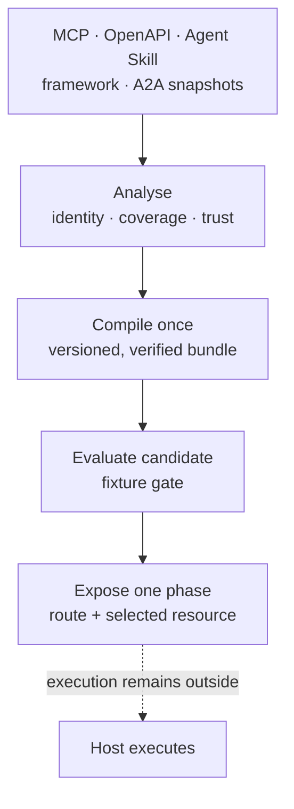

# The 60-second failure mode

> Two deterministic proofs, each with no API key and no network: a
> compiler-first capability-surface proof and the original tool/context-pressure
> demo.

## Compiler-first: understand it in 10 seconds

An agent's effective capabilities often arrive through several formats and
wrappers. Their identities can collide, required resources can go missing, and
the surface seen in one environment may be hard to reproduce in another.



ContextWeaver's compiler foundation turns deterministic source snapshots into a
content-addressed portable bundle, evaluates the bounded candidate selected for
the current phase, and hydrates only that capability's declared resource. The
host still decides whether and how to execute it.

### Copy/paste success in under a minute

From a checkout with ContextWeaver installed, run the package module:

```bash
python -m contextweaver.compiler
```

That exact module command is executed in subprocess tests on every normal CI
lane, and its exact stdout is committed in
[`tests/fixtures/compiler_demo_expected.txt`](../tests/fixtures/compiler_demo_expected.txt)
and byte-compared in CI, including under optimized Python (`-O`). The existing
built-wheel smoke separately validates isolated `uvx`/`pipx` packaging and the
public console entry point; it does not currently claim to execute this module
proof from the wheel.

The first receipt reports:

- five representative source snapshots and five normalized capabilities;
- one real cross-source identity ambiguity: two namespaces expose
  `draft payment reminder`;
- a content-addressed, verified bundle and its format/example versions;
- one explicit fixture evaluation gate before runtime hydration;
- a phase allowlist that reduces exposure to one capability and one required
  Agent Skill resource;
- a degraded recompile where the missing required digest blocks only the
  affected capability, followed by the remediation result.

These counts and outcomes describe only
[`build_demo_snapshots()`](../src/contextweaver/compiler/__main__.py) at
`fixture-v1`. They are a regression fixture, not a universal benchmark.

### Deep walkthrough: the same maintained example

#### 1. Discover and analyse the candidate surface

`build_demo_snapshots()` constructs five versioned
`CapabilitySourceSnapshot` objects representing MCP, OpenAPI, Agent Skills,
one framework object, and A2A. Two snapshots intentionally use the same human
name in different namespaces. `analyze_collisions()` reports that ambiguity
before compilation.

This is an honest fixture boundary: the demo does **not** run source-specific
network/filesystem discovery. Every snapshot carries
`discovery_executed=False`, the receipt says
`discovery=fixture-snapshots`, and CI asserts both. Use the existing
source adapters separately when turning real inputs into `SelectableItem`
objects; dedicated compiler discovery adapters remain future work.

#### 2. Compile, inspect, and verify

`build_bundle_from_snapshots()` normalizes the five snapshots into one
`CompiledBundle`. `write_bundle()` emits a content-addressed directory:

| File | What it makes inspectable |
|---|---|
| `agent.json` | agent identity and fixture version |
| `capabilities.json` | normalized, deterministic capability surface |
| `resources.json` | required resource identity, digest, size, and closure |
| `lock.json` | source snapshots, adapter versions, coverage, provenance |
| `manifest.json` | component digests, logical bundle digest, trust summary |

`CompiledAgent.load()` verifies the on-disk component hashes, logical digest,
directory identity, and recomputed trust projection before the runtime facade
is constructed. The demo uses a temporary directory only to leave no local
state; the same bundle format is portable to a caller-owned path.

A bundle diff surface is not shipped yet, so this demo does not invent one.
The content-addressed directory and deterministic JSON files are already
ordinary diff inputs; a first-class semantic diff remains tracked by
[#434](https://github.com/dgenio/contextweaver/issues/434).

#### 3. Evaluate before exposing runtime context

The maintained `compiler-demo-eval-v1` fixture asks for a payment reminder.
The demo evaluates three conditions before hydration:

1. the routed top candidate is `skill.draft_reminder`;
2. runtime trust allows that candidate;
3. the `draft-reminder` phase namespace allowlist exposes exactly one
   candidate.

This is a one-case adoption regression gate, not evidence of general routing
quality. Broader comparative claims remain gated on
[#445](https://github.com/dgenio/contextweaver/issues/445).

#### 4. Route and hydrate progressively

The verified bundle is loaded once. `CompiledAgent.route()` applies the
fixture's phase boundary (`allowed_namespaces={"skill"}`), then
`CompiledAgent.hydrate()` returns only the selected capability and its
declared `skill.reminder.instructions` resource.

ContextWeaver stops there. It does not call a model, fetch the resource, invoke
the tool, or authorize a side effect. The host owns credentials, authorization,
execution, and result ingestion.

#### 5. Observe failure and remediate it

The degraded variant removes the required Agent Skill resource digest and
recompiles. Runtime assessment becomes `unverified`; only
`skill.draft_reminder` is blocked while the other four capabilities remain
available. Restoring the digest returns the original verified assessment with
zero blocked capabilities.

This proves a non-token value: required resource closure can fail closed for
the affected capability without pretending the entire heterogeneous surface is
healthy or unusable.

### When not to use ContextWeaver

Use a simpler option when it solves the actual problem:

- For one provider and runtime-only selection, use provider-native deferred
  loading/tool search. OpenAI supports
  [hosted and client-executed tool search](https://developers.openai.com/api/docs/guides/tools-tool-search),
  and Claude Code
  [defers MCP schemas behind tool search](https://docs.anthropic.com/en/docs/claude-code/mcp).
- For a small, static surface, pass the few tool schemas directly.
- For MCP server lifecycle, container isolation, credentials, or profiles,
  [Docker MCP Gateway](https://docs.docker.com/ai/mcp-catalog-and-toolkit/mcp-gateway/)
  is the more direct product.
- For a single MCP-only surface where reproducibility, pre-runtime evaluation,
  source provenance, and phase-aware context are not problems, a normal MCP
  client or gateway is enough.
- Do not use ContextWeaver as a tool executor, authorization layer, sandbox,
  agent framework, or prompt-injection defense; it provides none of those
  guarantees.

ContextWeaver is the better fit when you need a provider-independent,
inspectable capability artifact before runtime, or when its phase-aware
routing/context-result behavior is independently useful. Provider-native tool
search can also consume a bounded surface produced upstream; the approaches
are complementary.

## Runtime context-pressure demo

The original demo shows why a naive tool-using agent loop breaks down — and
what ContextWeaver does about it — in one command:

```bash
contextweaver demo --scenario killer
```

(Also available as `python -m contextweaver demo --scenario killer`.)

## The scenario

An internal ops agent with **100 tools** and a running conversation. The
user asks:

> "Find unpaid invoices, check the account notes, and draft a reminder."

A naive loop pays for three things at once:

1. **The tool catalog** — all 100 tool descriptions injected into the route
   prompt.
2. **The conversation history** — every prior turn included raw.
3. **A huge tool result** — the invoice/account dump pasted straight back
   into the answer prompt.

contextweaver narrows each one:

| | Naive | contextweaver | Reduction |
|---|---|---|---|
| Tools in the route prompt | all 100 descriptions (6,326 chars) | 5 ChoiceCards (491 chars) | **92.2%** |
| The huge tool result | raw (14,430 chars) | firewalled summary (60 chars) | **99.6%** |
| The full answer prompt | everything raw (21,332 chars) | compiled (814 chars) | **96.2%** |

Sizes are reported in **characters** (deterministic everywhere). The demo
also prints a token estimate using the active tokeniser.

## What you are seeing

- **Route narrows the catalog.** `Router.route(query)` turns 100 tools into a
  5-card shortlist — the [Tool Router](tool_router.md) at work. The model
  never sees 100 schemas.
- **The firewall externalises the big result.** The ~14 KB invoice dump is
  stored out-of-band as an artifact and replaced with a short summary — the
  [Context Firewall](context_firewall.md). The raw bytes stay addressable.
- **The answer prompt is compiled, not concatenated.** A budget-aware build
  keeps the relevant history plus the summary, instead of dumping everything.

## Where to go next

- The [catalog showcase architecture](architectures/catalog_showcase.md) is
  the same runtime-pressure story as a runnable, inspectable script with
  `BuildStats`.
- The [Showcase](showcase.md) walks the other `demo --scenario` flows
  (`large-catalog`, `huge-tool-output`, `mcp-gateway-full`).
- The [Quickstart](quickstart.md) shows the direct-API version you would
  embed in your own agent loop.
- The [compiler-first adoption track](roadmap/compiler-first-backlog-audit-2026-07.md)
  records the broader product direction and remaining launch gates.
